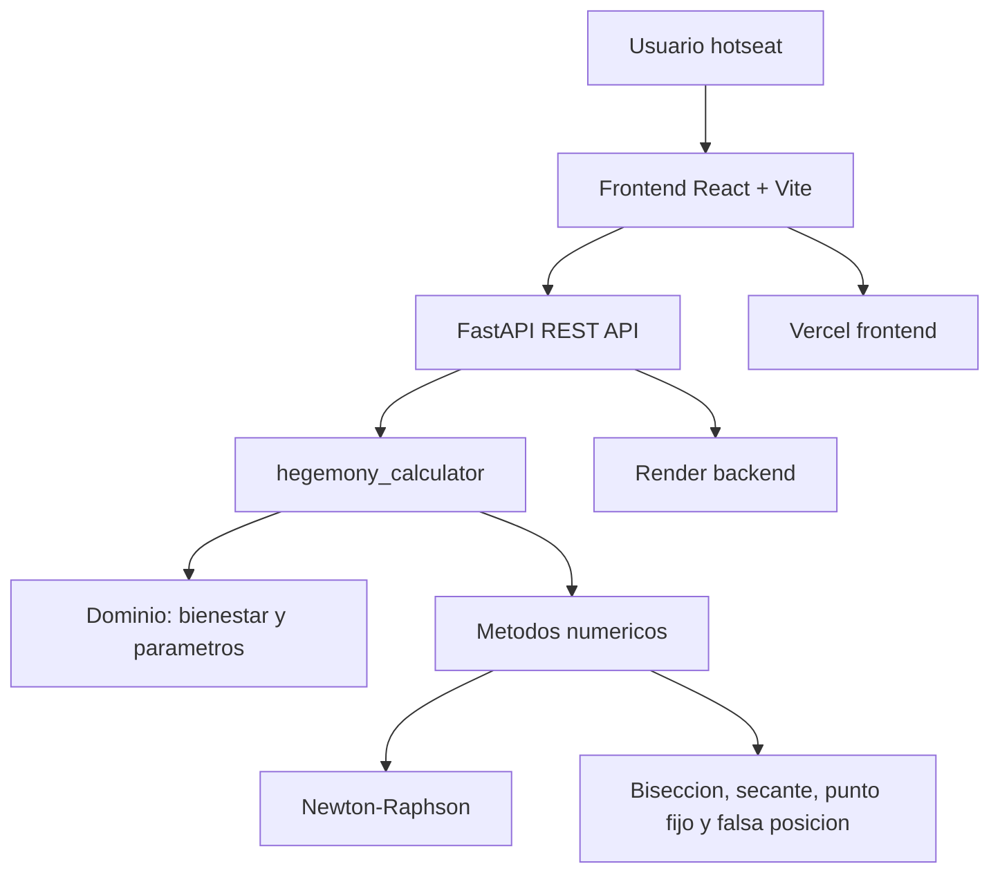

<div align="center">

# Hegemony Linear

**Hotseat web simulator with a FastAPI numerical engine for Newton-Raphson income analysis.**

[](https://react.dev/)
[](https://vite.dev/)
[](https://fastapi.tiangolo.com/)
[](https://www.python.org/)
[](https://tailwindcss.com/)
[](LICENSE)

[Live app](https://hegemony-linear.vercel.app/) |
[API](https://hegemony-fastapi-backend.onrender.com/) |
[API docs](https://hegemony-fastapi-backend.onrender.com/docs)

</div>

---

**[Espanol](#espanol) | [English](#english)**

---

## Gallery

<table>
  <tr>
    <td align="center" width="50%">
      
      <br/><strong>Hotseat game board</strong>
    </td>
    <td align="center" width="50%">
      
      <br/><strong>Narrative result from the numerical engine</strong>
    </td>
  </tr>
  <tr>
    <td align="center" colspan="2">
      
      <br/><strong>Teacher mode: convergence chart and iteration table</strong>
    </td>
  </tr>
</table>

---

<h2 id="espanol">Espanol</h2>

## Acerca del proyecto

**Hegemony Linear** es una adaptacion web academica tipo hotseat inspirada en *Hegemony: Lead Your Class to Victory*. El objetivo no es clonar el juego de mesa, sino convertir sus tensiones economicas en una experiencia interactiva donde un motor numerico calcula el ingreso minimo que necesita la Clase Trabajadora para alcanzar una meta de prosperidad.

El backend resuelve la raiz de `f(I) = W(I) - S*` con **Newton-Raphson**. El jugador no interactua con la ecuacion directamente: ve decisiones de salarios, impuestos, bienes y politicas; el sistema traduce el resultado matematico a consecuencias de juego.

> Proyecto academico y de portafolio. No esta afiliado ni respaldado por los titulares del juego de mesa original.

## Funcionalidades principales

- Simulador hotseat para Clase Trabajadora, Clase Capitalista, Clase Media y Estado.
- Tablero de rondas con politicas fiscales, precios de bienes y asignacion de obreros.
- Calculo de ingreso minimo requerido mediante API FastAPI.
- Modal narrativo que explica si los salarios actuales cubren la meta de prosperidad.
- Modo profesor con raiz calculada, error final, grafica de convergencia y tabla de iteraciones.
- Frontend desplegado en Vercel y backend desplegado en Render.
- Suite de pruebas para metodos numericos, bienestar, impuestos, validador y motor de juego.

## Arquitectura



## Stack tecnologico

| Capa | Tecnologia |
|---|---|
| Frontend | React 19, Vite 7, Tailwind CSS, Recharts, Lucide React |
| Backend | FastAPI, Pydantic, Uvicorn |
| Motor numerico | Python, Newton-Raphson, busqueda de raices |
| Analisis | NumPy, Pandas |
| Testing | Pytest, Vite build |
| Deploy | Vercel para frontend, Render para backend |

## Estructura del proyecto

```text
Hegemony-Linear/
|-- backend/                         # API FastAPI
|   |-- main.py
|-- frontend/                        # Aplicacion React/Vite
|   |-- src/
|   |   |-- App.jsx
|   |   |-- index.css
|   |   `-- main.jsx
|   |-- package.json
|   `-- vercel.json
|-- hegemony_calculator/             # Dominio, metodos numericos y motor
|   |-- core/
|   |-- engine/
|   |-- services/
|   `-- data/
|-- tests/                           # Pruebas Pytest
|-- docs/
|   |-- assets/                      # Capturas del README
|   |-- deployment.md
|   |-- github-repository-setup.md
|   `-- usage-guide.md
|-- render.yaml
|-- requirements.txt
`-- README.md
```

## Inicio rapido

### Prerrequisitos

- Python 3.11 o superior.
- Node.js 24.14.0 usando `fnm`.
- PowerShell en Windows.

### Backend local

```powershell
cd D:\Desarrollo\Proyectos\UPB\Hegemony-Linear
python -m venv .venv
.\.venv\Scripts\Activate.ps1
python -m pip install --upgrade pip
python -m pip install -r requirements.txt
python -m uvicorn backend.main:app --reload --host 127.0.0.1 --port 8000
```

Servicios locales:

| Servicio | URL |
|---|---|
| API | `http://127.0.0.1:8000` |
| Swagger UI | `http://127.0.0.1:8000/docs` |
| Health check | `http://127.0.0.1:8000/api/health` |

### Frontend local

```powershell
cd D:\Desarrollo\Proyectos\UPB\Hegemony-Linear\frontend
fnm use 24.14.0
npm.cmd install
Copy-Item .env.example .env
npm.cmd run dev -- --host 127.0.0.1 --port 5173
```

El frontend queda disponible en `http://127.0.0.1:5173`.

## Variables de entorno

| Archivo | Variable | Descripcion |
|---|---|---|
| `frontend/.env` | `VITE_API_URL` | URL base del backend FastAPI. En local usa `http://127.0.0.1:8000`; en produccion usa Render. |

## API principal

```http
POST /api/calculate-income
Content-Type: application/json
```

Ejemplo minimo:

```json
{
  "P": 10,
  "tau": 0.22,
  "F0": 4,
  "H0": 0,
  "E0": 0,
  "L0": 0,
  "S*": 2.97
}
```

La respuesta incluye `I_star`, `required_income`, `converged`, `iterations`, `final_error`, `history` y una narrativa lista para el tablero.

## Pruebas y verificacion

```powershell
cd D:\Desarrollo\Proyectos\UPB\Hegemony-Linear
python -m pytest

cd D:\Desarrollo\Proyectos\UPB\Hegemony-Linear\frontend
fnm use 24.14.0
npm.cmd run build
```

## Documentacion

| Documento | Proposito |
|---|---|
| [docs/README.md](docs/README.md) | Indice documental del proyecto. |
| [docs/deployment.md](docs/deployment.md) | Guia de despliegue Vercel + Render. |
| [docs/usage-guide.md](docs/usage-guide.md) | Guia de uso, demo y video de sustentacion. |
| [docs/github-repository-setup.md](docs/github-repository-setup.md) | Recomendaciones para About, topics, releases y deployments en GitHub. |
| [CONTRIBUTING.md](CONTRIBUTING.md) | Flujo de contribucion. |
| [CODE_OF_CONDUCT.md](CODE_OF_CONDUCT.md) | Codigo de conducta. |
| [SECURITY.md](SECURITY.md) | Reporte responsable de vulnerabilidades. |
| [CHANGELOG.md](CHANGELOG.md) | Registro de cambios. |

## Contribucion, seguridad y licencia

Las contribuciones son bienvenidas bajo el flujo descrito en [CONTRIBUTING.md](CONTRIBUTING.md). Para vulnerabilidades, no abras issues publicos: sigue [SECURITY.md](SECURITY.md). El proyecto esta licenciado bajo [MIT](LICENSE).

---

<h2 id="english">English</h2>

## About

**Hegemony Linear** is an academic hotseat web simulation inspired by *Hegemony: Lead Your Class to Victory*. It turns economic decisions into an interactive board where a numerical backend calculates the minimum income required for the Working Class to reach a prosperity target.

The backend solves `f(I) = W(I) - S*` with **Newton-Raphson**. The player sees wages, taxes, goods and policy outcomes; the teacher panel exposes the convergence details for academic review.

> Academic and portfolio project. It is not affiliated with or endorsed by the owners of the original board game.

## Key features

- Hotseat simulator for Working Class, Capitalist Class, Middle Class and State turns.
- Board state with fiscal policy, public goods, wages and worker allocation.
- Minimum required income calculation through a FastAPI backend.
- Narrative result modal that explains whether current wages meet the prosperity target.
- Teacher mode with root, final error, convergence chart and iteration table.
- Production frontend on Vercel and backend on Render.
- Pytest suite for numerical methods, welfare, taxes, validation and game engine behavior.

## Quick start

```powershell
cd D:\Desarrollo\Proyectos\UPB\Hegemony-Linear
python -m venv .venv
.\.venv\Scripts\Activate.ps1
python -m pip install --upgrade pip
python -m pip install -r requirements.txt
python -m uvicorn backend.main:app --reload --host 127.0.0.1 --port 8000
```

```powershell
cd D:\Desarrollo\Proyectos\UPB\Hegemony-Linear\frontend
fnm use 24.14.0
npm.cmd install
Copy-Item .env.example .env
npm.cmd run dev -- --host 127.0.0.1 --port 5173
```

## Testing

```powershell
cd D:\Desarrollo\Proyectos\UPB\Hegemony-Linear
python -m pytest

cd D:\Desarrollo\Proyectos\UPB\Hegemony-Linear\frontend
fnm use 24.14.0
npm.cmd run build
```

## Production

| Service | Provider | URL |
|---|---|---|
| Frontend | Vercel | https://hegemony-linear.vercel.app/ |
| Backend API | Render | https://hegemony-fastapi-backend.onrender.com/ |
| API docs | Render / Swagger UI | https://hegemony-fastapi-backend.onrender.com/docs |

## License

Released under the [MIT License](LICENSE).
