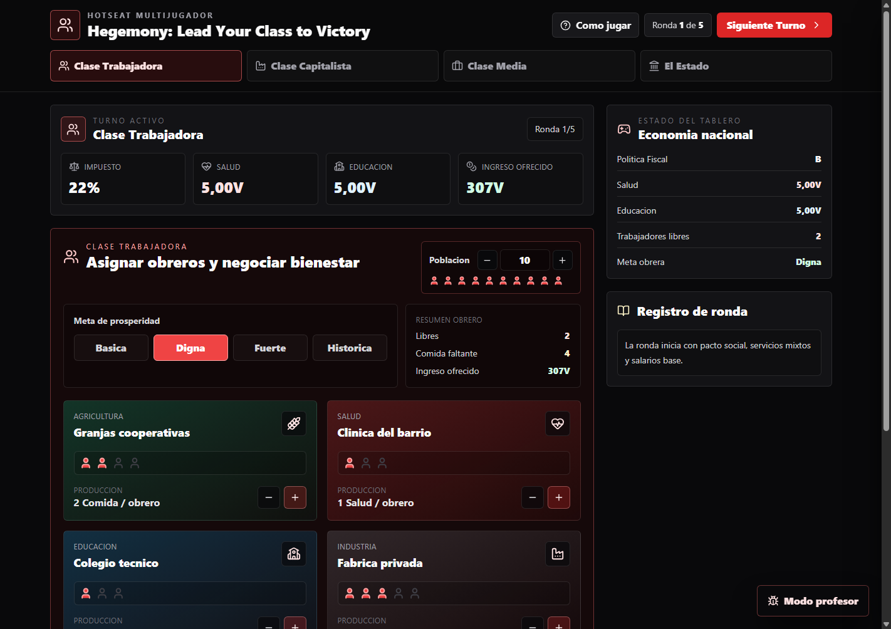
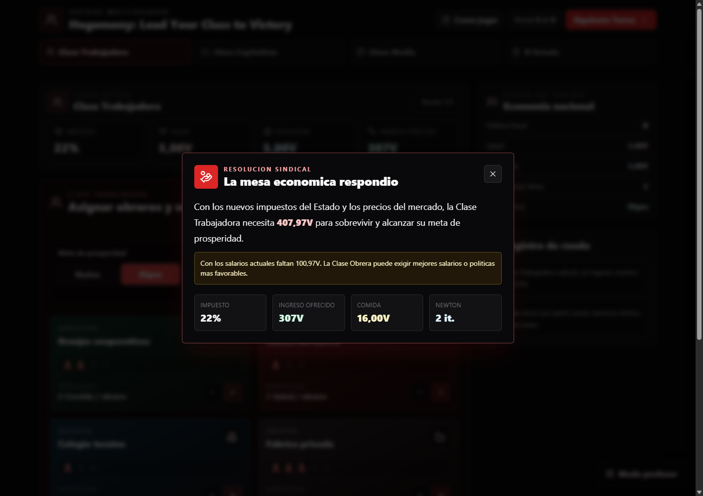
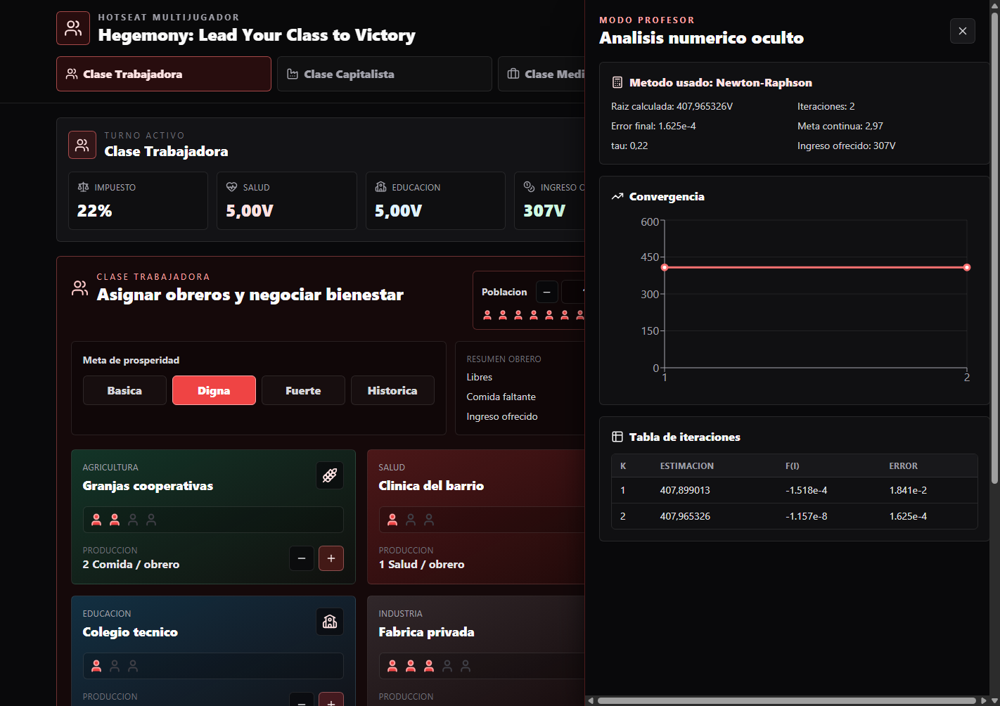
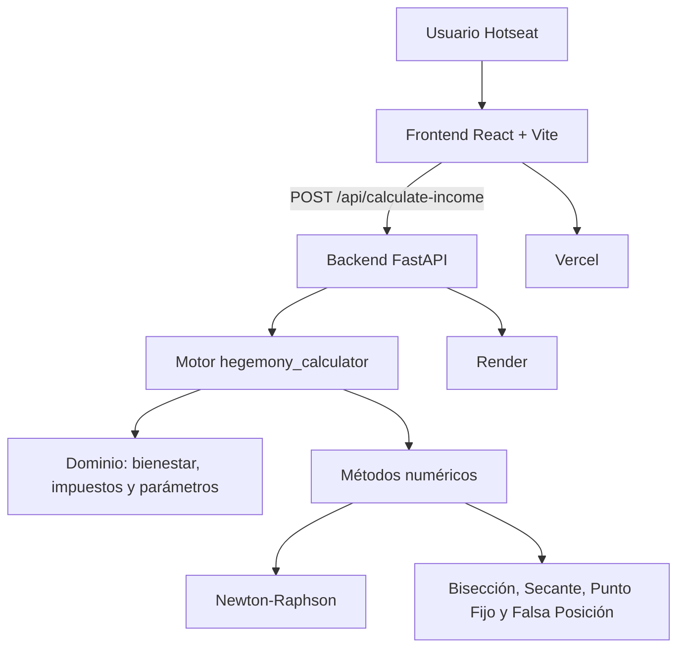

<div align="center">

# 🎲 Hegemony Linear

**Simulador web hotseat de economía política para Análisis Numérico (UPB), construido con React, FastAPI y un motor Newton-Raphson para calcular el ingreso mínimo de prosperidad de la Clase Trabajadora.**

[](https://react.dev/)
[](https://vite.dev/)
[](https://fastapi.tiangolo.com/)
[](https://www.python.org/)
[](https://tailwindcss.com/)
[](LICENSE)

[🌐 Aplicación](https://hegemony-linear.vercel.app/) ·
[⚙️ API](https://hegemony-fastapi-backend.onrender.com/) ·
[📘 Swagger Docs](https://hegemony-fastapi-backend.onrender.com/docs)

</div>

---

<p align="center">
  <a href="#-español">Español</a> · <a href="#-english">English</a>
</p>

---

## 🖼️ Galería / Showcase

<table>
  <tr>
    <td align="center" width="50%">
      
      <br/><strong>Tablero hotseat multijugador</strong>
    </td>
    <td align="center" width="50%">
      
      <br/><strong>Resultado narrativo del motor numérico</strong>
    </td>
  </tr>
  <tr>
    <td align="center" colspan="2">
      
      <br/><strong>Modo profesor: raíz, error, convergencia e iteraciones</strong>
    </td>
  </tr>
</table>

---

# 🇪🇸 Español

## 📌 Acerca del Proyecto

**Hegemony Linear** es una adaptación web académica tipo **hotseat** inspirada en *Hegemony: Lead Your Class to Victory*. Fue desarrollado para la materia de **Análisis Numérico** en la **Universidad Pontificia Bolivariana (UPB)**, integrando simulación económica, experiencia interactiva y métodos numéricos aplicados.

El objetivo del proyecto es demostrar cómo un método de búsqueda de raíces puede funcionar dentro de una experiencia de juego: la Clase Trabajadora, la Clase Capitalista, la Clase Media y el Estado toman decisiones sobre salarios, impuestos, bienes y políticas públicas; luego, el backend calcula el ingreso mínimo necesario para alcanzar una meta de prosperidad.

El modelo numérico resuelve:

```text
f(I) = W(I) - S*
```

Donde `I` es el ingreso bruto, `W(I)` es el bienestar calculado y `S*` es la meta de prosperidad. El jugador no ve la ecuación como una calculadora aislada: la aplicación traduce el resultado a una consecuencia política y económica dentro del tablero.

> Proyecto académico y de portafolio. No está afiliado ni respaldado por los titulares del juego de mesa original.

## 🚀 Funcionalidades Principales

- **Simulación hotseat multiclase:** Clase Trabajadora, Clase Capitalista, Clase Media y Estado.
- **Tablero económico interactivo:** rondas, salarios, impuestos, precios de bienes y asignación de obreros.
- **Motor numérico real:** cálculo de ingreso mínimo con Newton-Raphson desde una API FastAPI.
- **Narrativa de juego:** el resultado matemático se presenta como negociación económica, no como fórmula suelta.
- **Modo profesor:** raíz calculada, error final, tabla de iteraciones y gráfica de convergencia.
- **Despliegue público:** frontend en Vercel y backend en Render.
- **Pruebas automatizadas:** cobertura del motor numérico, bienestar, impuestos, validación y lógica de juego.

## 🏗️ Arquitectura del Sistema



## 🛠️ Stack Tecnológico

| Capa | Tecnología |
|---|---|
| **Frontend** | React 19, Vite 7, Tailwind CSS, Recharts, Lucide React |
| **Backend** | FastAPI, Pydantic, Uvicorn |
| **Motor Numérico** | Python, Newton-Raphson, búsqueda de raíces |
| **Análisis** | NumPy, Pandas |
| **Testing** | Pytest, Vite Build |
| **Deploy** | Vercel (frontend), Render (backend) |

## 📁 Estructura del Proyecto

```text
Hegemony-Linear/
├── backend/                         # API FastAPI
│   └── main.py
├── frontend/                        # Aplicación React/Vite
│   ├── src/
│   │   ├── App.jsx
│   │   ├── index.css
│   │   └── main.jsx
│   ├── package.json
│   └── vercel.json
├── hegemony_calculator/             # Dominio, motor y métodos numéricos
│   ├── core/
│   ├── engine/
│   ├── services/
│   └── data/
├── tests/                           # Pruebas Pytest
├── docs/
│   ├── assets/                      # Capturas del README
│   ├── deployment.md
│   └── usage-guide.md
├── render.yaml
├── requirements.txt
└── README.md
```

## ⚡ Inicio Rápido

### Prerrequisitos

- **Python 3.11+**
- **Node.js 24.14.0** usando `fnm`
- **PowerShell** en Windows

### Backend Local

```powershell
cd D:\Desarrollo\Proyectos\UPB\Hegemony-Linear
python -m venv .venv
.\.venv\Scripts\Activate.ps1
python -m pip install --upgrade pip
python -m pip install -r requirements.txt
python -m uvicorn backend.main:app --reload --host 127.0.0.1 --port 8000
```

| Servicio | URL |
|---|---|
| API | `http://127.0.0.1:8000` |
| Swagger UI | `http://127.0.0.1:8000/docs` |
| Health Check | `http://127.0.0.1:8000/api/health` |

### Frontend Local

```powershell
cd D:\Desarrollo\Proyectos\UPB\Hegemony-Linear\frontend
fnm use 24.14.0
npm.cmd install
Copy-Item .env.example .env
npm.cmd run dev -- --host 127.0.0.1 --port 5173
```

El frontend queda disponible en:

```text
http://127.0.0.1:5173
```

## 🔐 Variables de Entorno

| Archivo | Variable | Descripción |
|---|---|---|
| `frontend/.env` | `VITE_API_URL` | URL base del backend FastAPI. En local usa `http://127.0.0.1:8000`; en producción usa Render. |

## 📡 API Principal

```http
POST /api/calculate-income
Content-Type: application/json
```

Ejemplo mínimo:

```json
{
  "P": 10,
  "tau": 0.22,
  "F0": 4,
  "H0": 0,
  "E0": 0,
  "L0": 0,
  "S*": 2.97
}
```

La respuesta incluye `I_star`, `required_income`, `converged`, `iterations`, `final_error`, `history` y una narrativa lista para el tablero.

## 🧪 Pruebas y Verificación

```powershell
cd D:\Desarrollo\Proyectos\UPB\Hegemony-Linear
python -m pytest

cd D:\Desarrollo\Proyectos\UPB\Hegemony-Linear\frontend
fnm use 24.14.0
npm.cmd run build
```

## 📚 Documentación

| Documento | Propósito |
|---|---|
| [docs/README.md](docs/README.md) | Índice documental del proyecto. |
| [LEARN.md](LEARN.md) | Guía educativa para GitHub Education y estudiantes de Análisis Numérico. |
| [docs/deployment.md](docs/deployment.md) | Guía de despliegue en Vercel + Render. |
| [docs/usage-guide.md](docs/usage-guide.md) | Guía de uso, demo y video de sustentación. |
| [CONTRIBUTING.md](CONTRIBUTING.md) | Flujo de contribución. |
| [CODE_OF_CONDUCT.md](CODE_OF_CONDUCT.md) | Código de conducta. |
| [SECURITY.md](SECURITY.md) | Reporte responsable de vulnerabilidades. |
| [CHANGELOG.md](CHANGELOG.md) | Registro de cambios. |

## 🤝 Contribución

Las contribuciones son bienvenidas. Consulta la [Guía de Contribución](CONTRIBUTING.md) para conocer el flujo de trabajo, estilo de commits y verificación esperada.

## 🔒 Seguridad

Si descubres una vulnerabilidad, **no abras un issue público**. Sigue el proceso descrito en [SECURITY.md](SECURITY.md).

## 📄 Licencia

Este proyecto está licenciado bajo la [Licencia MIT](LICENSE).

---

# 🇺🇸 English

## 📌 About the Project

**Hegemony Linear** is an academic **hotseat** web adaptation inspired by *Hegemony: Lead Your Class to Victory*. It was developed for the **Numerical Analysis** course at **Universidad Pontificia Bolivariana (UPB)**, combining economic simulation, interactive UX and applied numerical methods.

The project demonstrates how a root-finding method can live inside a game-like experience: the Working Class, Capitalist Class, Middle Class and State make decisions about wages, taxes, goods and policies; then the backend calculates the minimum income required to reach a prosperity target.

## 🚀 Key Features

- **Multi-class hotseat simulation:** Working Class, Capitalist Class, Middle Class and State.
- **Interactive economic board:** rounds, wages, taxes, goods prices and worker allocation.
- **Real numerical engine:** minimum income calculation with Newton-Raphson through FastAPI.
- **Game narrative:** mathematical results are presented as economic negotiation outcomes.
- **Teacher mode:** calculated root, final error, iteration table and convergence chart.
- **Public deployment:** frontend on Vercel and backend on Render.
- **Automated tests:** numerical methods, welfare, taxes, validation and game-engine behavior.

## ⚡ Quick Start

```powershell
cd D:\Desarrollo\Proyectos\UPB\Hegemony-Linear
python -m venv .venv
.\.venv\Scripts\Activate.ps1
python -m pip install --upgrade pip
python -m pip install -r requirements.txt
python -m uvicorn backend.main:app --reload --host 127.0.0.1 --port 8000
```

```powershell
cd D:\Desarrollo\Proyectos\UPB\Hegemony-Linear\frontend
fnm use 24.14.0
npm.cmd install
Copy-Item .env.example .env
npm.cmd run dev -- --host 127.0.0.1 --port 5173
```

## 🧪 Testing

```powershell
cd D:\Desarrollo\Proyectos\UPB\Hegemony-Linear
python -m pytest

cd D:\Desarrollo\Proyectos\UPB\Hegemony-Linear\frontend
fnm use 24.14.0
npm.cmd run build
```

## 🌐 Production

| Service | Provider | URL |
|---|---|---|
| Frontend | Vercel | https://hegemony-linear.vercel.app/ |
| Backend API | Render | https://hegemony-fastapi-backend.onrender.com/ |
| API Docs | Render / Swagger UI | https://hegemony-fastapi-backend.onrender.com/docs |

## 📄 License

Released under the [MIT License](LICENSE).
